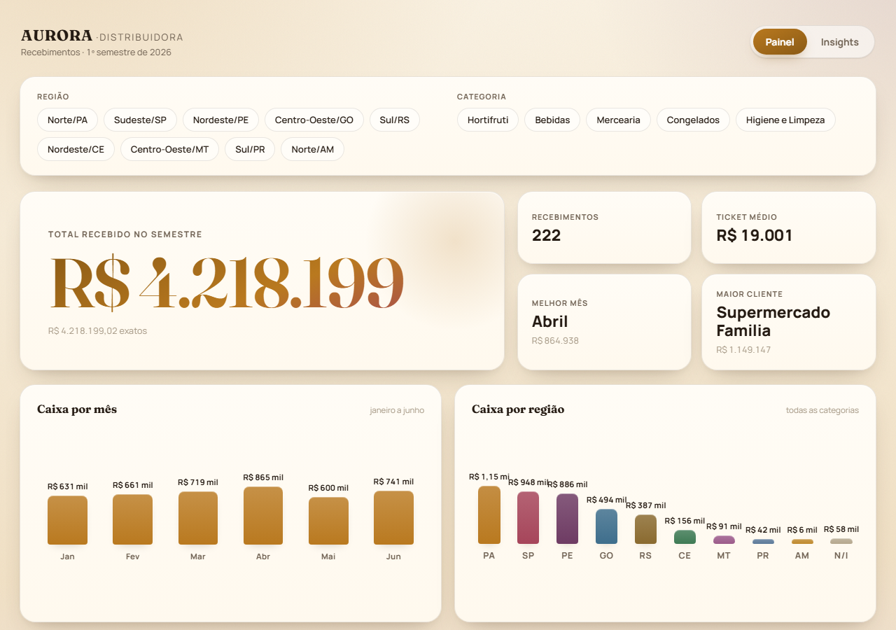

# Dashboard Distribuidora Aurora

Controle e análise dos recebimentos do 1º semestre de 2026 da Distribuidora Aurora Ltda.

## Conteúdo

- **`Painel_Aurora.html`** — dashboard interativo standalone (abre direto no navegador, sem servidor): 5 KPIs, 4 gráficos com filtro cruzado por Região e Categoria, e uma aba de Insights com a leitura executiva do semestre.

A planilha de trabalho (`Controle_Recebimentos.xlsx`) e os comprovantes originais não estão neste repositório por conterem dados financeiros sensíveis de clientes.

## Resumo do semestre

- Total recebido: **R$ 4.218.199,02** em 222 recebimentos
- Ticket médio: R$ 19.000,90
- Melhor mês: Abril (R$ 864.938,31)
- Maior cliente: Supermercado Família (R$ 1.149.147,31)

## Licença

Distribuído sob a licença MIT — veja [LICENSE](LICENSE).
